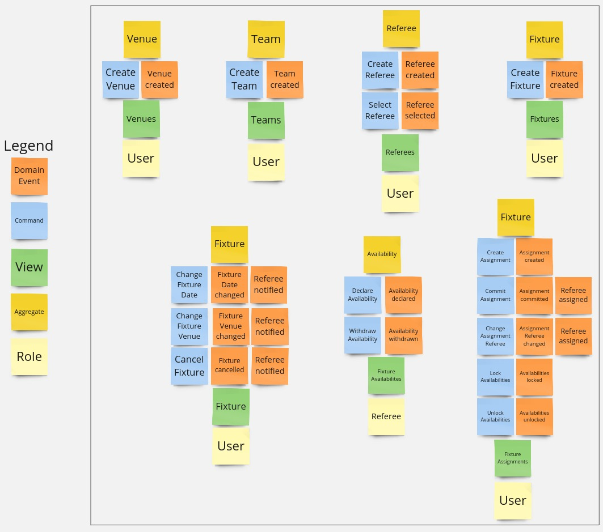
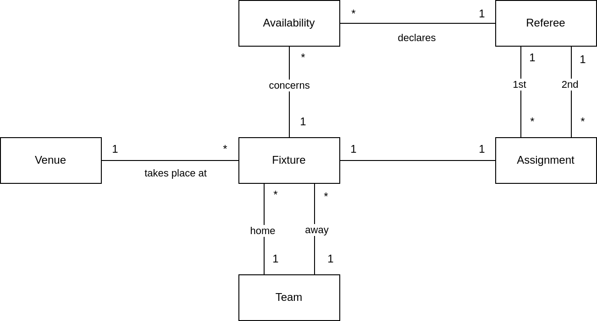

# Day 1

On Day 1 the focus is on explicitly stating my motivation, aims and objectives, as well as fleshing out the domain both via high-level textual description and using more structured approaches such as Event Storming, User Stories and UML Diagrams.

## Motivation, Aims and Objectives

In the following I clearly state my motivation, aims and objectives as they are important to put the whole undertaking into a proper context that helps to understand certain decisions. 

Very broadly speaking my most fundamental motivation underlying this undertaking is to simply get more experience in Rust. So far I have 6 months of industry experience in Rust from my time at Generation Lambda where I wrote a number of services such as simple REST services, a blockchain data extractor and a rewards payout tool for Cardano. With this project however, I want to look into a different direction: DDD and Microservices. I have taught DDD and Microservices in my position as lecturer in Software Engineering to undergraduates and conducted Software Engineering seminars where students had to implement a project using DDD. However so far, I only had limited opportunity to explore DDD and Microservices in production, which should change now with this project. Yes, I am aware that this is not a proper industry setting, but its a good first step towards building up more experience.

An important point here is to make that DDD is not a very hot topic in Rust, therefore Rust would definitely not be my first choice when having to implement a Domain using DDD and Microservices for production use - other ecosystems such as Java and C# have everything you need for it with very mature frameworks and tools. In fact, I have around 10 years of industry experience in Java using JavaEE and Spring, which are frameworks that make implementation of (Micro)services using DDD rather easy. The point in using Rust is to put all these little challenges and learning opportunities into a box and grow from there, instead of relying on established languages and frameworks, which would make the whole undertaking rather boring.

Therefore this project pursues the following objectives:
- Deepen my Rust experience.
- Explore implementing Tactical DDD in Rust - note that the focus is on Tactical, not Strategic DDD.
- Explore implementing a Web UI via WASM in Rust.
- Explore implementing Microservices in Rust. 

My aim is to start with a Monolith and then slice it into Microservices to avoid trying to do too many things at once. Also, starting with a Monolith is often the default and then slicing it out into Microservices is easier once the domain is properly established.

I want to make testing an important aspect of the whole project. I see automated tests as an essential part of every Software Engineering project, however one has to be clever about it: writing no tests is as stupid as mindlessly writing tests just to cover your code as much as possible. With tests it is the same as with coding: you need to think and consider where tests bring a benefit and where they are just boilerplate/noise/liability. I am going to follow the well-known testing pyramid:
- Unit tests only for complex domain and/or Controller logic.
- Integration tests only for (complex) queries and for driving the implementation of the DB integration code.
- E2E tests for testing whole scenarios.

## Unknowns, open Questions and Hypotheses
As in every such undertaking, a number of initial unknowns, open questions and hypotheses popped up in my head, which I brain-dumped here, to not lose keep track of them and to guide the whole undertaking.

- How to interact with DB? Using *sqlx* or an ORM such as *diesel* or *seaorm*? 
    - I lean towards *sqlx* as I have used *diesel* in production and was not too impressed with it, as you run into limitations such as transaction handling and more complex queries pretty quickly when you do non-trivial things.
- How to represent Entities, Value Objects, Aggregates, Domain Events (and how to broadcast them) and Repositories? 
    - Aggregate/Entity: probably is *mut* and methods implemented as *mut*.
    - Value objects are immutable with immutable methods, returning copies.

- An interesting challenge will be to update an Aggregate or Entity in the DB after some domain logic executed. A naive approach would be to update all fields and Entities/Value objects, but a more sophisticated approach could calculates a diff from the originally loaded version, but that is also more complex. Or could we follow a unit-of-work pattern implementation? How much effort and how difficult would that be in Rust?

- How can we abstract Repositories without exposing the need for an *sqlx* Connection/Transaction object? We want to avoid passing the *sqlx* connection to be able to write testable code. We could employ some form of per-thread global Connection/Transaction context. Or much simpler: instantiate the Repository in the REST handler using the Connection object but pass it as *dyn* to the Controller logic.

- Should we use some form of dependency injection e.g. using *shaku*? 
    - Given that Java / Spring relies heavily on dependency injection by declarative management via annotations, it would be interesting to see if this makes sense in Rust as well. 
    - We might be able to declare transactional boundaries via custom Rust Attributes.
    - However as nice as it sounds, given the fundamentally different nature of Rust, I doubt this is a viable direction to follow.

- How do we deploy multiples of the same Microservices? 
    - Probably use a reverse proxy, such as Nginx.

- How to best split the initial Monolith into Microservices and how to communicate between them?
    - The splitting depends heavily on the domain implementation - potentially splitting by Aggregates or even Entities. So we have to wait until these are clear and stable, which should be the case when the Monolith implementation is finished.
    - Fetching information shall be done by means of REST endpoints exposed by the respective service.
    - Broadcasting and listening to Domain Events is done via Kafka. Build in idempotency to solve the problem of different transactional contexts between Kafka and DB.
    - Use some form of log aggregation.

## Domain and Requirements

### High-Level Domain Description

The idea is to implement a simple Volleyball referee management tool that allows for assigning of 1st and 2nd referees to Fixtures between two Teams that are taking place at specific Venues.

Referees declare their availability to Fixtures, and the *Admin* is using these Availabilities then to decide which referee to assign to which Fixture. Referees should also be able to withdraw Availabilities but only until some limited time before the Assignments are handed out. The *Admin* should be able to lock Availabilities, which has the consequence that Referees are not able to declare or withdraw Availabilities anymore, so that the *Admin* can create assignments without concurrent changes to Availabilities.

The Assignment process should be a two-step one: first, the *Admin* assigns Referees which constitutes *staged* changes, that are not fixed yet. Then after the *Admin* is happy with the assignments, they *commit* the assignments, making them fixed, notifying the Referees.

Fixtures can get cancelled, or their time or venue changed, which requires some form of notification to the assigned Referees or Referees that declared availability.

It should be possible for the *Admin* to replace already assigned Referees with other Referees, with Referees getting notifications accordingly. 

The tool should also allow the creation of Referees, Venues, Teams and Fixtures. Note that in a proper industry-ready solution this information is very likely coming from a different system that needs to be integrated, but for sake of simplicity, in this project we ignore this.

Also in this tool there is no need for explicitly implementing *Admins*, that is, no need for implementing any login functionality and/or roles. However the UI should allow to switch between the views of different Referees.

### Event Storming

I did a quick Event Storming to model the domain before fleshing out User Stories. [Event Storming](https://en.wikipedia.org/wiki/Event_storming) is a light-weight deliberate discovery technique, to quickly find out what is happening in the domain.

### User Stories

We essentially have only 2 roles:

1. *Admin* is the generic user that views the Web UI, can create Referees, Teams, Venues, Fixtures and does the whole assignment process.
2. *Referee* is the referee the Admin selected to work as, declares and withdraws Availabilities and gets notified in case of changes.

#### Referee

- **Create Referee.** As Admin I want to be able to create new Referees, so that Referees can be managed.
- **Get Referee by Id.** As Admin I want to be able to get Referees by their Id, so that I can get information about them individually.
- **Get all Referees.** As Admin I want to get all Referees in the system, so that I can select the Referee I want to work as.
- **Select Referee.** As Admin I want to select the Referee I want to work with, so that I can declare and withdraw their availabilities.

#### Team

- **Create Team.** As Admin I want to be able to create new Teams, so that I can use them to create Fixtures.
- **Get Team by Id.** As Admin I want to be able to get a Team by its Id, so that I can get information about it individually.
- **Get all Teams.** As Admin I want to be able get all Teams in the system, so that I can select Teams when creating Fixtures.

#### Venue

- **Create Venue.** As Admin I want to be able to create new Venues, so that I can use them to create Fixtures.
- **Get Venue by Id.** As Admin I want to be able to get a Venue by its Id, so that I can get information about it individually.
- **Get all Venues.** As Admin I want to be able get all Venues in the system, so that I can select Venues when creating Fixtures.

#### Fixture

- **Create Fixture.** As Admin I want to be able to create new Fixtures, so that we have Fixtures in the System that reflect the scheduled real Fixtures.
- **Get all Fixtures within time range.** As Admin I want to be able to get all Fixtures within a time range, so that I can assign Referees to them.
- **Get Fixture by Id.** As Admin I want to be able to get a Fixture by its Id, so that I can get information about it individually.
- **Change Date.** As Admin I want to be able to change the date of a Fixture, so that the assigned Referees get notified.
- **Change Venue.** As Admin I want to be able to change the Venue of a Fixture, so that the assigned Referees get notified.
- **Cancel Fixture.** As Admin I want to be able to cancel a Fixture, so that the assigned Referees get notified.

#### Availability

- **Declare Availability.** As a Referee I want to declare Availability to a given Fixture, so that the Admin knows for which Fixture I am available and which not.
- **Withdraw Availability.** As a Referee I want to be able to withdraw a previously declared Availability, so that I am flexible with declaring my Availabilities.
- **Lock Availabilities.** As Admin I want to lock Availabilities, so that Referees are not able to concurrently change them while I am working on Assignments.
- **Unlock Availabilities.** As Admin I want to unlock Availabilities after I have locked them, so that Referees can declare or withdraw their Availabilities again.

#### Assignment

- **Create Assignment.** As Admin I want to create an Assignment, so that a Fixture has Referees.
- **Commit Assignment.** As Admin I want to commit an Assignment, so Referees are notified of their assignment.
- **Change Referee.** As Admin I want to be able to change Referees of an Assignment, so that I have the flexibility in case of some changes.

### Domain Model Diagram

Below I have added a Diagram of the Domain Model to show all Domain concepts and their relationships. Note that it is an initial design that serves only as starting point and might differ from the final implementation. The diagram was created using draw.io

